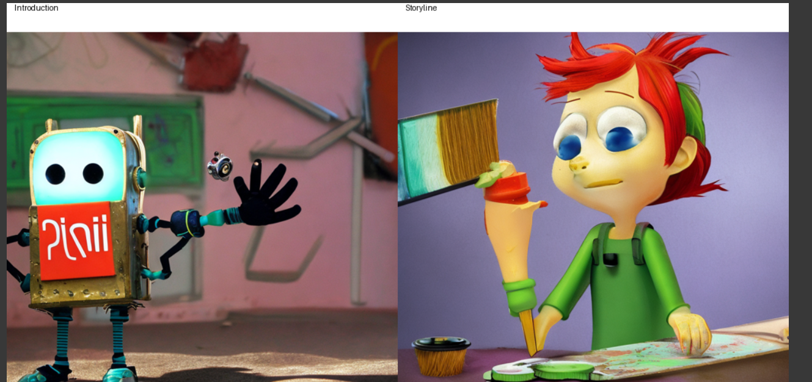

# 🎨 Comic Crafter AI

**Generate AI-powered comics using Stable Diffusion and Gradio!**

## 🚀 Features
- AI-based story-driven image generation
- Stable Diffusion v2 for high-quality illustrations
- Automatic comic layout generation
- Gradio-powered web interface for easy interaction

---

## 📌 Installation

### 1️⃣ Clone the Repository
```bash
git clone https://github.com/yourusername/comic-crafter-ai.git
cd comic-crafter-ai
```

### 2️⃣ Install Dependencies
```bash
pip install --upgrade torch torchvision torchaudio bitsandbytes diffusers transformers gradio pillow
```

---

## 🎨 Usage

### Run the Comic Generator
```bash
python app.py
```

The application will launch a **Gradio web UI**, where you can enter story prompts and generate a comic.

---

## 🛠 How It Works

1. **LLM Story Prompting:** The user inputs four prompts – Introduction, Storyline, Climax, and Moral.
2. **AI Image Generation:** Stable Diffusion generates an image for each prompt.
3. **Comic Layout:** The images are arranged in a 2x2 grid with titles.
4. **Web UI:** A Gradio-based UI allows easy user interaction.

---

## 🖼 Example Output

After inputting prompts, the final comic layout will look like this:



---

## 📌 Future Improvements
- Improve prompt engineering for better image coherence
- Add speech bubbles and captions
- Support for multiple page comics

---

## 🤝 Contributing
Feel free to fork the repository and submit pull requests with improvements!

---

## 📜 License
This project is licensed under the **MIT License**.

---

Happy coding! 🚀🎨
